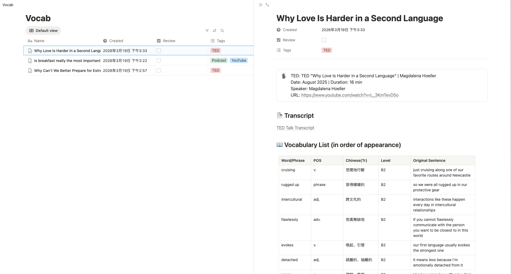

# vocabot

Turn any YouTube video, TED Talk, podcast, or blog post into structured language learning notes — automatically saved to Notion.

Paste a URL, get a vocabulary list, key phrases, and memorable sentences. No more pausing and scribbling.

**[See it in action](https://torpid-streetcar-536.notion.site/328aaf31ee5581e38410e9003d78eb96?v=328aaf31ee558156a2ec000c19f17846)**



## What It Does

You give it a URL:

```
/vocab https://www.ted.com/talks/catherine_nakalembe_why_can_t_we_better_prepare_for_extreme_weather
```

It gives you a Notion page with:

| Section | What's inside |
|---------|--------------|
| Vocabulary List | 10-20 words slightly above your level, with translations and original sentences |
| Key Phrases | Idioms, collocations, and natural expressions |
| Good Sentences | Quotes worth remembering |

Works with **any language pair**. Learning English from Chinese? Japanese from English? Korean from Spanish? Just configure it.

## Examples

```bash
# English TED Talk → Chinese vocabulary notes
/vocab https://www.ted.com/talks/some_great_talk

# Japanese YouTube video → English vocabulary notes
/vocab https://www.youtube.com/watch?v=abc123

# English podcast → Korean vocabulary notes
/vocab https://podcasts.apple.com/podcast/example/id123?i=456

# French blog post → Japanese vocabulary notes
/vocab https://www.lemonde.fr/some-article
```

## Prerequisites

- [Node.js](https://nodejs.org/) >= 18
- [Claude Code](https://claude.ai/code)
- A [Notion](https://www.notion.so/) account with an [API integration](https://www.notion.so/my-integrations)

## Quick Start

```bash
git clone https://github.com/Adoraxuu/vocabot.git
cd vocabot
npm install
```

Then run the setup wizard in your project directory:

```bash
mkdir my-vocab && cd my-vocab
node /path/to/vocabot/bin/cli.js init
```

The wizard walks you through everything:

1. **Notion API token** — paste your integration token
2. **Notion page** — paste the page URL where you want vocab entries (database is created automatically)
3. **Language settings** — pick your source language, target language, and proficiency level

Done. Open Claude Code and start dropping URLs.

## Supported Content

| Type | How it gets the transcript |
|------|---------------------------|
| YouTube | Subtitles via `yt-dlp` |
| TED Talks | TED transcript page, happyscribe.com |
| Podcast | Show notes, podscribe.app, taddy.org, happyscribe.com |
| Blog | Article body extraction |

## Configuration

After running `vocabot init`, two config files are created in your project directory:

- **`.env`** — your Notion token (secret, gitignored)
- **`.vocabot.json`** — page ID, languages, level

Want to change settings? Just tell Claude Code to update `.vocabot.json`.

## Optional

- [`yt-dlp`](https://github.com/yt-dlp/yt-dlp) — better YouTube transcript fetching (the wizard offers to install it)

## License

MIT

---

# vocabot（中文說明）

把任何 YouTube 影片、TED 演講、Podcast、部落格文章，自動轉成結構化的語言學習筆記 — 直接存進 Notion。

貼上網址，就能得到生詞表、重點片語、好句子。不用再邊看邊抄。

**[完成效果](https://torpid-streetcar-536.notion.site/328aaf31ee5581e38410e9003d78eb96?v=328aaf31ee558156a2ec000c19f17846)**


## 它做了什麼

給它一個網址：

```
/vocab https://www.ted.com/talks/catherine_nakalembe_why_can_t_we_better_prepare_for_extreme_weather
```

它會在 Notion 建立一個頁面：

| 區塊 | 內容 |
|------|------|
| 生詞表 | 10-20 個略高於你程度的單字，附翻譯和原文例句 |
| 重點片語 | 慣用語、搭配詞、道地表達 |
| 好句子 | 值得記住的佳句 |

支援**任何語言組合**。用中文學英文？用英文學日文？用西班牙文學韓文？設定一下就好。

## 使用範例

```bash
# 英文 TED Talk → 中文生詞筆記
/vocab https://www.ted.com/talks/some_great_talk

# 日文 YouTube 影片 → 英文生詞筆記
/vocab https://www.youtube.com/watch?v=abc123

# 英文 Podcast → 韓文生詞筆記
/vocab https://podcasts.apple.com/podcast/example/id123?i=456

# 法文部落格 → 日文生詞筆記
/vocab https://www.lemonde.fr/some-article
```

## 事前準備

- [Node.js](https://nodejs.org/) >= 18
- [Claude Code](https://claude.ai/code)
- 一個 [Notion](https://www.notion.so/) 帳號，並建立 [API integration](https://www.notion.so/my-integrations)

## 快速開始

```bash
git clone https://github.com/Adoraxuu/vocabot.git
cd vocabot
npm install
```

在你的專案目錄執行設定精靈：

```bash
mkdir my-vocab && cd my-vocab
node /path/to/vocabot/bin/cli.js init
```

精靈會一步步引導你：

1. **Notion API token** — 貼上你的 integration token
2. **Notion 頁面** — 貼上頁面 URL，資料庫會自動建立在裡面
3. **語言設定** — 選擇原文語言、翻譯語言、程度等級

搞定。開啟 Claude Code，開始丟網址吧。

## 支援的內容類型

| 類型 | 取得逐字稿的方式 |
|------|-----------------|
| YouTube | 透過 `yt-dlp` 取得字幕 |
| TED Talks | TED 逐字稿頁面、happyscribe.com |
| Podcast | Show notes、podscribe.app、taddy.org、happyscribe.com |
| Blog | 擷取文章正文 |

## 設定檔

執行 `vocabot init` 後，會在你的專案目錄建立兩個設定檔：

- **`.env`** — Notion token（機密，已 gitignore）
- **`.vocabot.json`** — 頁面 ID、語言、程度

想改設定？直接跟 Claude Code 說要改 `.vocabot.json` 就好。

## 可選安裝

- [`yt-dlp`](https://github.com/yt-dlp/yt-dlp) — 更好的 YouTube 字幕擷取（設定精靈會問你要不要裝）

## 授權

MIT
